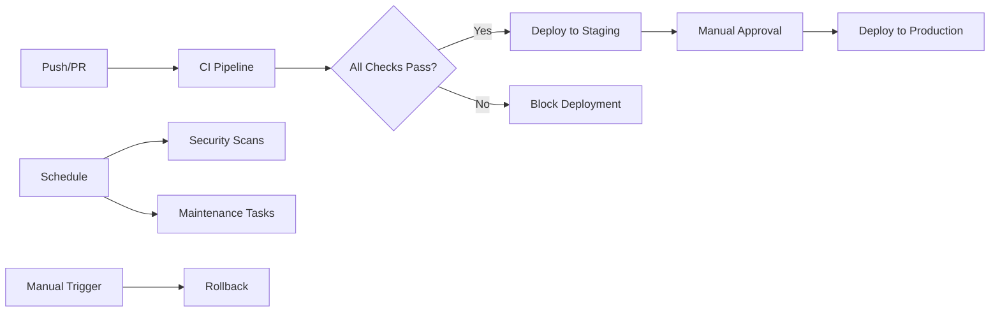

# CI/CD Pipeline Documentation

This document provides a comprehensive overview of the GitHub Actions CI/CD pipeline for the Kitchen Pantry CRM Next.js application.

## Table of Contents

1. [Pipeline Overview](#pipeline-overview)
2. [Workflow Files](#workflow-files)
3. [Environment Setup](#environment-setup)
4. [Security Configuration](#security-configuration)
5. [Deployment Process](#deployment-process)
6. [Monitoring and Alerts](#monitoring-and-alerts)
7. [Troubleshooting](#troubleshooting)

## Pipeline Overview

The CI/CD pipeline consists of several interconnected workflows designed to ensure code quality, security, and reliable deployments.

### Pipeline Architecture



## Workflow Files

### 1. CI Pipeline (`ci.yml`)

**Purpose**: Main continuous integration workflow that runs on every push and pull request.

**Jobs**:
- **quality-checks**: TypeScript, ESLint, Prettier validation
- **security-scan**: SAST, dependency scanning, secret detection
- **build-and-test**: Unit tests, E2E tests, coverage checks
- **performance-test**: Lighthouse CI, load testing, bundle analysis
- **docker-build**: Container building and security scanning
- **license-check**: License compliance verification

**Key Features**:
- Parallel job execution for faster feedback
- Matrix testing across Node.js versions
- Automated PR comments with results
- Test artifact preservation on failure

### 2. Security Scanning (`security.yml`)

**Purpose**: Comprehensive security analysis running daily and on security-related changes.

**Jobs**:
- **dependency-scan**: npm audit, Snyk, OWASP Dependency Check
- **sast-scan**: CodeQL, Semgrep analysis
- **secret-scan**: TruffleHog, Gitleaks
- **container-scan**: Trivy, Grype, Hadolint
- **iac-scan**: Checkov for infrastructure as code
- **compliance-check**: Security headers, environment variables

**Key Features**:
- Multiple security tools for comprehensive coverage
- Automated issue creation for critical findings
- SARIF format uploads for GitHub Security tab integration

### 3. Deployment (`deploy.yml`)

**Purpose**: Handles deployments to staging and production environments.

**Jobs**:
- **pre-deploy-validation**: Environment checks, incident verification
- **test**: Pre-deployment test suite
- **build**: Production build with optimization
- **deploy-staging**: Automatic staging deployment
- **production-approval**: Manual approval gate
- **deploy-production**: Blue-green deployment with slot swapping
- **post-deployment**: Notifications and documentation

**Key Features**:
- Blue-green deployments for zero downtime
- Automatic rollback on failure
- Database migration handling
- CDN cache purging
- Health check validation

### 4. Maintenance (`maintenance.yml`)

**Purpose**: Automated maintenance tasks running on schedule.

**Jobs**:
- **dependency-update**: Weekly dependency updates with PR creation
- **performance-benchmark**: Daily performance monitoring
- **cleanup**: Resource cleanup (old slots, artifacts)
- **security-patch**: Automated security patching

**Key Features**:
- Automated PR creation for updates
- Performance regression detection
- Resource optimization

### 5. Rollback (`rollback.yml`)

**Purpose**: Emergency rollback procedure for failed deployments.

**Jobs**:
- **validate-rollback**: Permission and version validation
- **backup-current**: Create backup before rollback
- **execute-rollback**: Deploy previous version
- **post-rollback**: Incident creation and notifications

**Key Features**:
- One-click rollback capability
- Automatic backup creation
- Incident tracking
- Failure recovery procedures

## Environment Setup

### Required Secrets

Configure these secrets in GitHub repository settings:

#### General Secrets
- `DATABASE_URL_TEST`: Test database connection string
- `GOOGLE_ID`: Google OAuth client ID
- `GOOGLE_SECRET`: Google OAuth client secret
- `GITHUB_ID`: GitHub OAuth app ID
- `GITHUB_SECRET`: GitHub OAuth app secret
- `JWT_SECRET`: JWT signing secret

#### Azure Secrets
- `AZURE_CREDENTIALS_STAGING`: Azure service principal for staging
- `AZURE_CREDENTIALS_PRODUCTION`: Azure service principal for production
- `AZURE_WEBAPP_NAME_STAGING`: Staging web app name
- `AZURE_WEBAPP_NAME_PRODUCTION`: Production web app name
- `AZURE_RESOURCE_GROUP_STAGING`: Staging resource group
- `AZURE_RESOURCE_GROUP_PRODUCTION`: Production resource group
- `DATABASE_URL_STAGING`: Staging database connection
- `DATABASE_URL_PRODUCTION`: Production database connection

#### Security Tool Secrets
- `SNYK_TOKEN`: Snyk authentication token
- `CODECOV_TOKEN`: Codecov upload token

#### Optional Secrets
- `SLACK_WEBHOOK_URL`: Slack notifications
- `AZURE_CDN_ENDPOINT`: CDN endpoint name
- `AZURE_CDN_PROFILE`: CDN profile name

### Environment Configuration

Create these environments in GitHub settings:

1. **staging**
   - No protection rules
   - Deployment URL: `https://your-app-staging.azurewebsites.net`

2. **production-approval**
   - Required reviewers: 1-2 team members
   - Deployment branches: `main` only

3. **production**
   - Required reviewers: 2+ team members
   - Deployment branches: `main` only
   - Deployment URL: `https://your-app.azurewebsites.net`

## Security Configuration

### CodeQL Configuration

The `.github/codeql/codeql-config.yml` file defines:
- Languages to analyze (JavaScript, TypeScript)
- Security query suites
- Custom security rules
- Path inclusions/exclusions

### Security Headers

Configure in `next.config.js`:

```javascript
const securityHeaders = [
  {
    key: 'X-DNS-Prefetch-Control',
    value: 'on'
  },
  {
    key: 'Strict-Transport-Security',
    value: 'max-age=63072000; includeSubDomains; preload'
  },
  {
    key: 'X-XSS-Protection',
    value: '1; mode=block'
  },
  {
    key: 'X-Frame-Options',
    value: 'SAMEORIGIN'
  },
  {
    key: 'X-Content-Type-Options',
    value: 'nosniff'
  },
  {
    key: 'Referrer-Policy',
    value: 'origin-when-cross-origin'
  }
];
```

## Deployment Process

### Staging Deployment

1. Code pushed to `main` branch
2. CI pipeline runs all checks
3. On success, automatic deployment to staging
4. Database migrations run
5. Health checks validate deployment
6. Smoke tests ensure functionality

### Production Deployment

1. Manual trigger or approval after staging
2. Create backup slot of current production
3. Deploy to staging slot first
4. Run validations on staging slot
5. Swap staging and production slots
6. Validate production health
7. Update CDN cache
8. Monitor key metrics

### Rollback Process

1. Trigger rollback workflow manually
2. Specify environment and reason
3. System creates backup of current state
4. Previous version is deployed
5. Database migrations rolled back if needed
6. Health checks validate rollback
7. Incident report created

## Monitoring and Alerts

### Performance Monitoring

- Daily Lighthouse CI runs
- Performance metrics tracked:
  - Performance score
  - First Contentful Paint (FCP)
  - Largest Contentful Paint (LCP)
  - Time to Interactive (TTI)
  - Requests per second
  - P99 latency

### Security Monitoring

- Daily vulnerability scans
- Real-time secret detection
- Dependency update notifications
- Compliance checks

### Notifications

Configure notifications through:
- GitHub Issues (automatic)
- Slack webhooks
- Email notifications
- Azure Monitor alerts

## Troubleshooting

### Common Issues

1. **Build Failures**
   - Check Node.js version compatibility
   - Verify environment variables
   - Clear caches if needed

2. **Test Failures**
   - Review test artifacts
   - Check for flaky tests
   - Verify test database setup

3. **Deployment Failures**
   - Check Azure credentials
   - Verify resource availability
   - Review deployment logs

4. **Performance Regressions**
   - Compare with baseline metrics
   - Check bundle size
   - Review recent changes

### Debug Commands

```bash
# Check workflow syntax
act --list

# Test workflow locally
act push --secret-file .env.secrets

# Validate Azure connection
az login --service-principal -u $CLIENT_ID -p $CLIENT_SECRET --tenant $TENANT_ID
az webapp list --resource-group $RESOURCE_GROUP

# Test health endpoint
curl -f https://your-app.azurewebsites.net/api/health
```

### Support Contacts

- **Pipeline Issues**: DevOps team
- **Security Concerns**: Security team
- **Performance Problems**: Performance team
- **General Support**: Create issue in repository

## Best Practices

1. **Always test locally** before pushing
2. **Keep secrets secure** - never commit them
3. **Monitor pipeline duration** - optimize if > 15 minutes
4. **Review security alerts** promptly
5. **Document breaking changes** in PRs
6. **Use semantic commit messages**
7. **Keep dependencies updated**
8. **Maintain high test coverage** (> 80%)

## References

- [GitHub Actions Documentation](https://docs.github.com/en/actions)
- [Azure Web Apps Documentation](https://docs.microsoft.com/en-us/azure/app-service/)
- [Next.js Deployment Documentation](https://nextjs.org/docs/deployment)
- [CodeQL Documentation](https://codeql.github.com/docs/)
- [Lighthouse CI Documentation](https://github.com/GoogleChrome/lighthouse-ci)