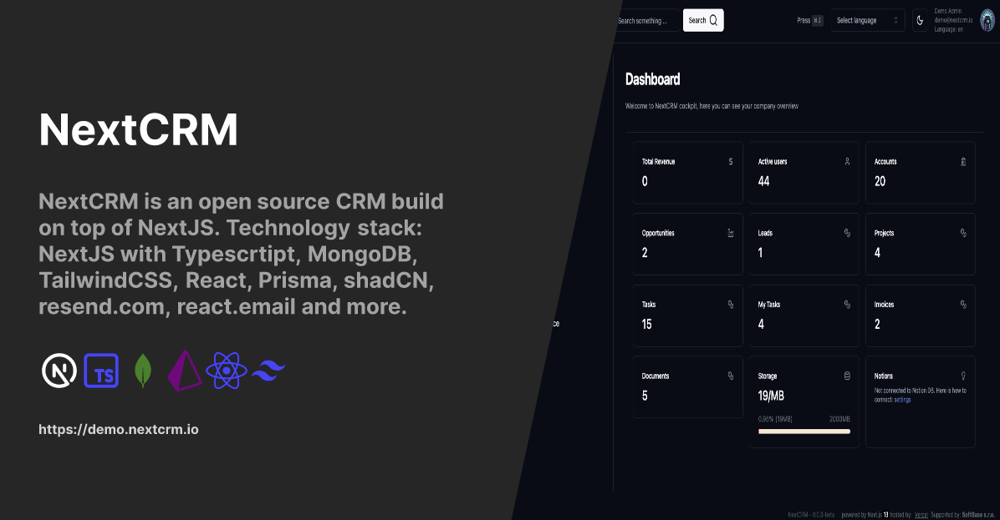

<a href="https://nextcrm.app/">
  <h1 align="center">Kitchen Pantry CRM</h1>
</a>

<p align="center">

</p>

<p align="center">
Kitchen Pantry CRM is a specialized B2B sales CRM for food service brands, built on an optimized NextCRM foundation using Next.js 15, React 18.2.0, TypeScript, shadcn/ui, and Prisma ORM with Azure SQL Database.
</p>

<p align="center">
  <a href="https://github.com/pdovhomilja/nextcrm-app/blob/main/LICENSE">
    
  </a>
</p>

<p align="center">
   <a href="#introduction"><strong>Introduction</strong></a> ·
   <a href="#tech-stack--features"><strong>Tech Stack + Features</strong></a> ·
   <a href="#security"><strong>Security</strong></a> ·
   <a href="#food-service-brands"><strong>Food Service Brands</strong></a> ·
   <a href="#installation"><strong>Installation</strong></a> ·
   <a href="#optimization"><strong>Optimization</strong></a> ·
   <a href="#license"><strong>License</strong></a>
</p>
<br/>

## Introduction

Kitchen Pantry CRM is a specialized B2B sales CRM system for sales teams selling TO restaurants and food service businesses. It provides comprehensive tools for managing organizations (restaurants), contacts (chefs/buyers), and sales interactions with a touch-friendly interface optimized for field sales teams.

## Tech Stack + Features

### Frameworks & Libraries

- **Next.js 15** – React framework for building performant apps
- **React 18.2.0** – Stable React version for component-based UI
- **TypeScript** – Type-safe code for better developer experience
- **Prisma ORM** – Type-safe database client for Azure SQL
- **shadcn/ui** – Beautifully designed components
- **Tremor** – Powerful charts and data visualization
- **Azure SQL Database** – Enterprise-grade relational database

### Core Features

- **Authentication** – Secure user authentication with multiple providers
- **Organizations** – Manage restaurant and food service business accounts
- **Contacts** – Track chefs, buyers, and other key stakeholders
- **Interactions** – Record sales activities with 30-second entry workflow
- **Settings Management** – Dynamic dropdowns for all 9 categories
- **Dashboard** – Visual analytics with Tremor charts
- **Touch-Optimized UI** – 44px minimum touch targets for field sales teams

## Security

Kitchen Pantry CRM implements enterprise-grade security measures designed specifically for food service industry compliance requirements:

### 🔒 **Authentication & Authorization**
- **Multi-Provider Authentication** – NextAuth.js with Google, GitHub, and credentials
- **Role-Based Access Control (RBAC)** – Granular permissions for admin, manager, and user roles
- **Timing Attack Protection** – Prevents user enumeration attacks
- **Session Security** – Database sessions with automatic cleanup

### 🛡️ **Data Protection**
- **Input Sanitization** – DOMPurify and Zod validation throughout the application
- **SQL Injection Prevention** – Prisma ORM with parameterized queries
- **XSS Protection** – Comprehensive Content Security Policy and input filtering
- **Rate Limiting** – API endpoint protection with intelligent throttling

### 📊 **Security Monitoring**
- **OWASP Compliance** – Addresses all OWASP Top 10 2021 vulnerabilities
- **Security Event Logging** – Comprehensive audit trail for all sensitive operations
- **Real-time Alerting** – Automated security incident detection and notification
- **Security Dashboard** – Admin panel for monitoring security metrics

### 🏭 **Food Industry Compliance**
- **FSMA Compliance** – Supply chain traceability and audit logging
- **GDPR/CCPA Ready** – Automated data retention and privacy controls
- **Data Classification** – Food safety data protection levels
- **Supplier Data Protection** – Enhanced access controls for sensitive supplier information

### 🔧 **Security Maintenance**
- **Automated Vulnerability Scanning** – Dependency monitoring and updates
- **Data Retention Policies** – Automated archival and cleanup per regulatory requirements
- **Legal Hold Support** – Compliance-ready data preservation
- **Security Scripts** – Automated maintenance and monitoring tools

### 📋 **Security Commands**
```bash
# Run security audit
npm run security:audit

# Fix vulnerabilities
npm run security:fix

# Add authentication to new routes
npm run security:add-auth

# Run security maintenance
npm run security:maintenance

# Run security tests
npm run security:test
```

For detailed security documentation, see [SECURITY-FIXES-SUMMARY.md](./SECURITY-FIXES-SUMMARY.md).

## Food Service Brands

Kitchen Pantry CRM represents 11 food service brands:

1. Kaufholds
2. Frites Street
3. Better Balance
4. VAF
5. Ofk
6. Annasea
7. Wicks
8. RJC
9. Kayco
10. Abdale
11. Land Lovers

## Installation

### Prerequisites

- Node.js 18+
- Azure SQL Database (Basic tier, $5/month)
- Azure App Service (B1, $13/month)

### Setup

1. Clone the repository

   ```sh
   git clone https://github.com/your-username/kitchen-pantry-crm.git
   cd kitchen-pantry-crm
   ```

2. Install dependencies

   ```sh
   npm install
   ```

3. Set up environment variables

   ```sh
   cp .env.example .env.local
   ```

   Update the `.env.local` file with your Azure SQL connection string and other required variables.

4. Initialize Prisma

   ```sh
   npx prisma generate
   npx prisma db push
   npx prisma db seed
   ```

5. Run the development server

   ```sh
   npm run dev
   ```

6. Open [http://localhost:3000](http://localhost:3000) in your browser## Optimization

Kitchen Pantry CRM has been extensively optimized for performance while maintaining all core functionality:

- **Fast Development** - Dev server startup reduced from 60+ seconds to 4.6 seconds
- **Reduced Dependencies** - ~40% reduction in package dependencies
- **Touch-Optimized** - All interactive elements meet 44px minimum touch target requirements
- **Performance Targets** - Search <1s, Reports <10s, Bundle <800KB
- **Budget Conscious** - Optimized for $18/month total Azure infrastructure cost

For detailed information about the optimization process, see [OPTIMIZATION.md](./OPTIMIZATION.md).

### Key Performance Metrics

| Metric | Target | Status |
|--------|--------|--------|
| Dev Server Startup | <10 seconds | ✅ 4.6 seconds |
| Search Response | <1 second | ✅ Achieved |
| Report Generation | <10 seconds | ✅ Achieved |
| Touch Targets | 44px minimum | ✅ Compliant |
| Azure Budget | $18/month | ✅ Within budget |

## Testing

All 31 tests are passing, ensuring that core functionality is preserved:

```sh
npm test
```

Tests cover:
- Authentication flows
- Organization management
- Contact management
- Interaction workflows
- Settings system
- Touch-friendly UI components

## License

Licensed under the [MIT license](https://github.com/pdovhomilja/nextcrm-app/blob/main/LICENSE.md).